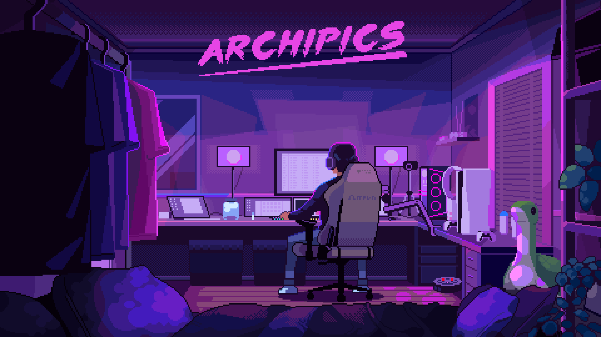

<h1 align="center">Hi 👋, I'm Nahid Hasan</h1>
<h3 align="center">Full-Stack Developer | Deep Learning Enthusiast | Technology Innovator from Bangladesh</h3>

  
  

---

### 🌱 About Me
I am a **full-stack software developer** passionate about designing scalable, maintainable, and high-performance applications. I thrive in environments where innovation meets practicality and enjoy leveraging **modern technologies** to solve real-world problems.  

Currently, I am enhancing my expertise in **Deep Learning** and AI-driven solutions while continuing to build **full-stack web and mobile applications**.

---

### 💬 Areas of Expertise
- **Frontend:** React.js, Next.js, HTML5, CSS3, Tailwind CSS  
- **Backend:** Node.js, Express.js, PHP, Python  
- **Mobile:** Android (Java/Kotlin)  
- **Databases:** MongoDB, MySQL  
- **DevOps & Tools:** Git, Firebase, Linux, Figma, VS Code  

---

### 📫 Connect With Me

  
  
  
  

---
📈 Productivity Stat's

  

### 🛠 Tech Stack

  
  
  
  
  
  
  
  
  
  
  
  
  
  
  
  

---
